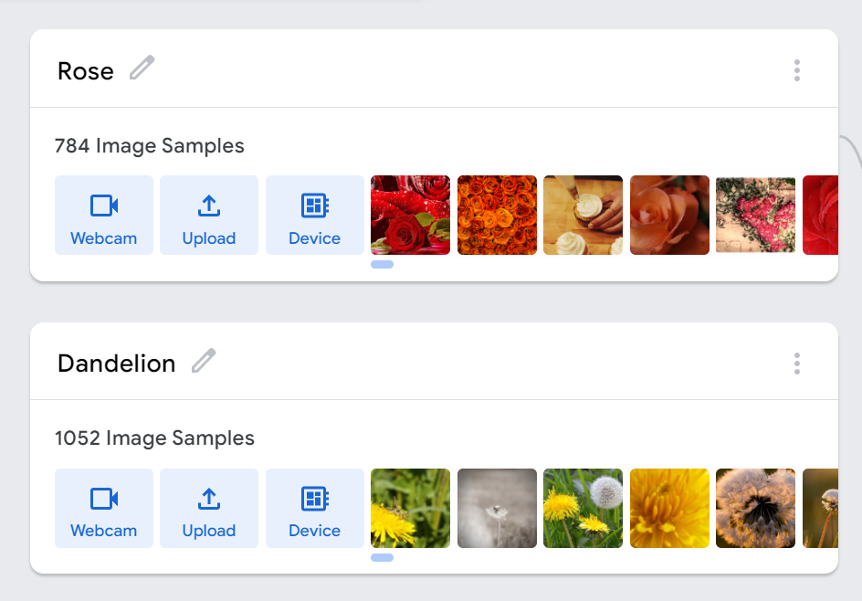
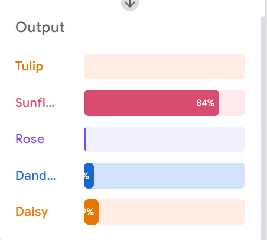

# Image_Model
creating a model that uses an image to classify objects using a teachable machine

# Teachable Machine
Teachable Machine is a web-based tool that makes creating machine learning models fast, easy, and accessible to everyone.

## How it works:
Three easy steps make it simple to use.

step1: Gather
To help the computer learn, gather and classify your samples into the classes or categories you want it to understand.

step2: Train
After you train your model, test it out instantly to see if it may classify fresh examples accurately.

step3: Export
Export your model for use in websites, applications, and other projects. Your model is available for download or hosting online.

## Type of model:

1. Images:
Teach a model to classify images using files or your webcam.

2. Sounds:
Teach a model to classify audio by recording short sound samples.

3. Poses:
Teach a model to classify body positions using files or striking poses in your webcam.

## The link to the website:
[URL](https://teachablemachine.withgoogle.com/train)

# Flowers Model
## DataSet:
This dataset contains 4242 images of flowers.

### Type of classes:

The pictures are divided into five classes:
1. Chamomile.
2. Tulip.
3. Rose.
4. Sunflower.
5. Dandelion.

Notes:
For each class, there are about 800 photos. Photos are not high resolution, about 320x240 pixels. 
Photos are not reduced to a single size, they have different proportions.

### By using the dataset from this link:
[link](https://www.kaggle.com/datasets/alxmamaev/flowers-recognition?resource=download)

### shots of the classes:
#### Step1:
Class One and Two:

Class Third and Fourth:

Class Five:

#### Step2:

After finishing classifying the class we will start training the model

#### Step3:

After finishing training the model we will start testing the model

The output after training and testing the model

# Teachable Machine Library 

Library for using image models created with Teachable Machine.

## You can use to access:

  The model topology: 
  The model metadata: 
